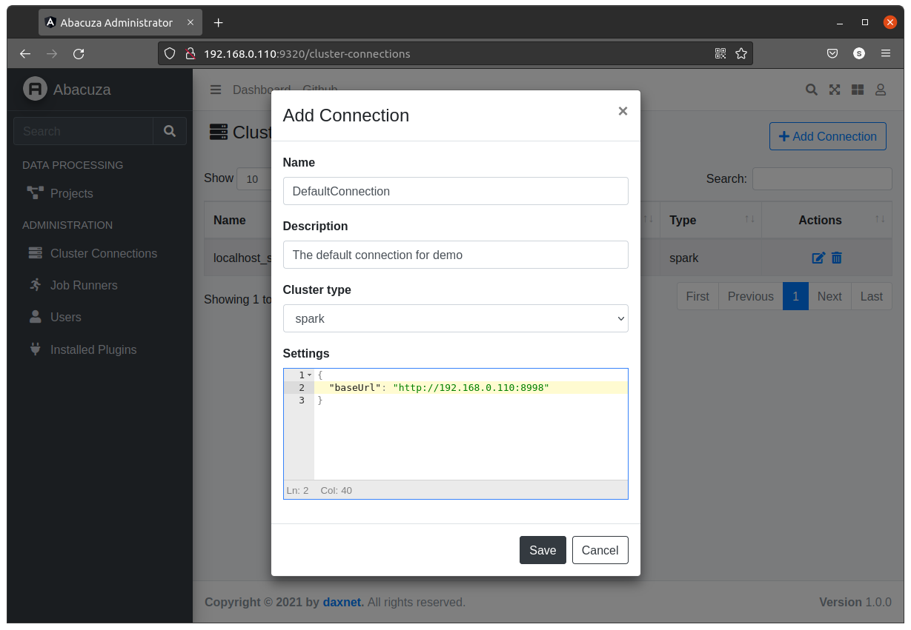
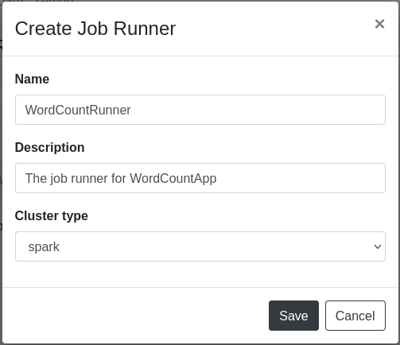

# Abacuza
A Simplified Data Processing Platform

[](https://dev.azure.com/sunnycoding/Abacuza/_build/latest?definitionId=8&branchName=master)


## Architecture Diagram


## Table of Contents
- [Abacuza](#abacuza)
  - [Architecture Diagram](#architecture-diagram)
  - [Table of Contents](#table-of-contents)
  - [Prerequisites](#prerequisites)
  - [How to Build](#how-to-build)
  - [How to Debug (Services)](#how-to-debug-services)
  - [How to Run (Debug Mode)](#how-to-run-debug-mode)
  - [How to Run](#how-to-run)
  - [Quick Start: Word Count](#quick-start-word-count)
    - [Develop the Word Count Application](#develop-the-word-count-application)
    - [Creating the Spark Cluster Connection](#creating-the-spark-cluster-connection)
    - [Preparing the Job Runner](#preparing-the-job-runner)
    - [Creating the Project](#creating-the-project)
  - [Documentation](#documentation)

## Prerequisites
- docker engine: v19.03 or above
- docker compose: v1.27.2 or above

## How to Build
1. Clone the repo:
   
   `git clone https://github.com/daxnet/abacuza`

2. Build everything with the following command:
   
   `docker-compose -f docker-compose.build.yaml build`

## How to Debug (Services)
1. Start the infrastructure services like database or redis cache:
   
   `docker-compose -f docker-compose.dev.yaml up`

2. Open `abacuza.sln` in Visual Studio 2019 from `src/services` directory
3. Press F5 to debug

## How to Run (Debug Mode)
1. Follow the instructions in [How to Debug (Services)](#how-to-debug-services) to start the infrastructure services and the backend services
2. Go to the `src/client` directory
3. Run `npm install` to install the dependencies
4. Run `npm start` to start the Angular development server at localhost:4200
5. Navigate to http://localhost:4200 in a web browser to access the Abacuza Administrator dashboard

## How to Run
1. Execute the following command to run everything:
   
   `docker-compose up`

2. Navigate to http://localhost:9320 in a web browser to access the Abacuza Administrator dashboard

## Quick Start: Word Count
Microsoft provides a .NET for Spark tutorial that demonstrates the counting of the words in a given text file. We will use that demo script to show the features and data processing capabilities provided by Abacuza.

### Develop the Word Count Application
An application in Abacuza describes how the data should be processed or transformed, it is usually developed by data scientists to meet their analysis needs. Applications will be assigned to the Job Runners and then loaded by the job runner when a project requests a data processing session. Developing an application for Abacuza involves the following tasks:

- Create a new .NET 5 console application
- Add `Microsoft.Spark` and `Abacuza.JobRunners.Spark.SDK` NuGet package reference
- Customize the application
- Build and pack the application

1. Create a new .NET 5 console application
   ```shell
   $ dotnet new console -f net5.0 -n WordCountApp
   ```
2. Add NuGet package reference
   ```shell
   $ dotnet add package Microsoft.Spark --version 2.0.0
   $ dotnet add package Abacuza.JobRunners.Spark.SDK --prerelease
   ```
3. Add a new class which derives from the `SparkRunnerBase`, actually its code is copied from the [example code provided by Microsoft](https://dotnet.microsoft.com/learn/data/spark-tutorial/code):
   ```csharp
   using Abacuza.JobRunners.Spark.SDK;
   using Microsoft.Spark.Sql;

   namespace WordCountApp
   {
      public class WordCountRunner : SparkRunnerBase
      {
         public WordCountRunner(string[] args) : base(args)
         {
         }

         protected override DataFrame RunInternal(SparkSession sparkSession, DataFrame dataFrame)
               => dataFrame
                  .Select(Functions.Split(Functions.Col("value"), " ").Alias("words"))
                  .Select(Functions.Explode(Functions.Col("words"))
                  .Alias("word"))
                  .GroupBy("word")
                  .Count()
                  .OrderBy(Functions.Col("count").Desc());
      }
   }
   ```
4. Modify the `Program.cs`, in the `Main` method, simply invoke the `WordCountRunner`:
   ```csharp
   static void Main(string[] args)
   {
      new WordCountRunner(args).Run();
   }
   ```
5. Under the WordCount project folder, execute the following command to publish the application that targets to Linux x64 platform:
   ```shell
   $ dotnet publish -c Release -f net5.0 -r linux-x64 -o published
   ```
6. Zip the contents in the `published` folder, note that the zip file should only contains the content under the `published` folder, the `published` folder itself shouldn't be zipped. For example, execute following command under Linux will zip the `published` folder into a ZIP file:
   ```shell
   $ zip -rj WordCountApp.zip published/.
   ```

### Creating the Spark Cluster Connection
Before doing the data transformation, you will need to create a cluster connection in Abacuza which connects to a data processing cluster. By default, Abacuza delivers the Spark cluster implementation, which is also the one that is used here.

1. Determine your IP address by using the `ifconfig` (or `ipconfig` under Windows)
2. Edit the `template.env` file and modify the `ACCESS_HOST` environment variable and set it to your IP address
3. Start Abacuza services and front-end dashboard by using the following command:
   ```shell
   $ docker-compose --env-file template.env up
   ```
   For more information about running Abacuza locally, please refer to [the steps above](#how-to-run)

4. Open your web browser, navigate to `http://<your-ip-address>:9320`, this opens the Abacuza dashboard
5. Login with your credential, by default, use `super` for username and `P@ssw0rd` for the password
6. In the left pane, click `Cluster Connections`, then in the `Cluster Connections` page, click the `Add Connection` button to create a new cluster connection
7. In the `Add Connection` dialog, fill in the name, description fields, for `Cluster type` choose `spark`. In the `Settings` text box, input the Spark settings in JSON format. To be simple, we just specify the base URL to the Spark livy. Click `Save` button to save the changes:

   

   ```json
   {
      "baseUrl": "http://192.168.0.110:8998"
   }
   ```

8. Now your cluster connection which connects to the running `Spark` instance should be ready


### Preparing the Job Runner
Follow the steps below to create a job runner in Abacuza.
1. Click `Job Runners` menu, then click the `Add Job Runner` button to create a new job runner
2. In the `Create Job Runner` dialog, fill in the name and description for the job runner, and for the `Cluster type`, choose `Spark`:

   

3. Click `Save` button, Abacuza will redirect you to the `Job Runner Details` page
4. In the `Job Runner Details` page, under the `Binaries` section, add the following two files to the `Job Runner`:

   1. `microsoft-spark-3-1_2.12-2.0.0.jar` - you can find it in your `published` folder
   2. `WordCountApp.zip` - This is the Zip file you created in step 6 of chapter [Develop the Word Count Application](#develop-the-word-count-application)

5. Under the `Payload template` section, use the following JSON document:
   ```json
   {
      "file": "${jr:binaries:microsoft-spark-3-1_2.12-2.0.0.jar}",
      "className": "org.apache.spark.deploy.dotnet.DotnetRunner",
      "args": [
      "${jr:binaries:WordCountApp.zip}",
      "WordCountApp",
      "${proj:input-defs}",
      "${proj:output-defs}",
      "${proj:context}"
      ]
   }
   ```
   Note that the `${jr:binaries}` place holder refers to the binary files that you've uploaded to the current job runner.
6. Save the job runner

### Creating the Project
1. Click `Projects` menu
2. In the `Projects` page, click the `Add Project` button to add a new project
3. In the `Add Project` dialog, fill in the name, description of the project. For `Input endpoint`, choose `Text Files`; for `Output endpoint`, choose `Console`, which means that we want the output of the data process to be shown in the console log. For the `Job Runner`, choose the one that we just created in previous steps

   

4. Save the project, the `Project Details` page will show
5. Let's prepare some data. Follow the instructions described on [Microsoft official site](https://dotnet.microsoft.com/learn/data/spark-tutorial/data) to create a `input.txt` file
6. On the `Project Details` page, under `INPUT` tab, add the `input.txt` as the project input

   

7. Click `Submit` button, the data processing job will be submitted to one of the clusters whose type is `spark`, and on that cluster, the customized application that we developed above will be executed for data processing. You can monitor the status of the execution from the `REVISIONS` tab of the `Project Details` page

   

8. Once the job is completed successfully, you can click the `log` icon to see the logs. In this example, you can see the following output in the log

   

For more information about the architecture, the design concepts and the developer's manual, please refer to the [Abacuza Documentation](docs/README.md).

## Documentation

Click [here](docs/README.md) for the documentation.
