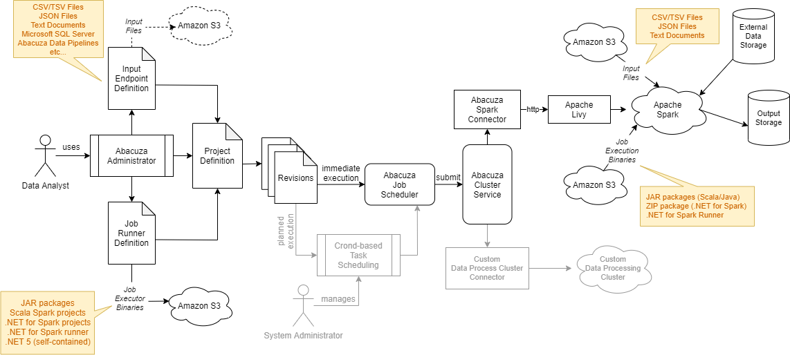

# Architecture
Following diagram shows the architecture of Abacuza.

A typical data processing workflow is as follows:
1. **Data Analyst** uses Abacuza Administrator web portal to define and manage data processing clusters. 
